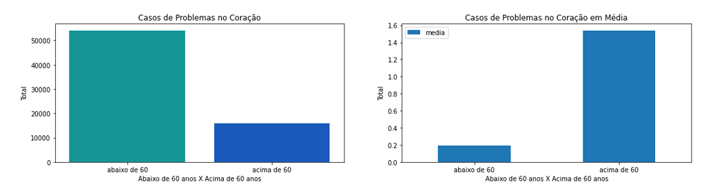
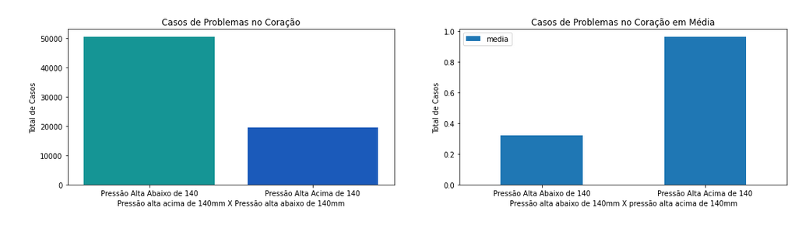
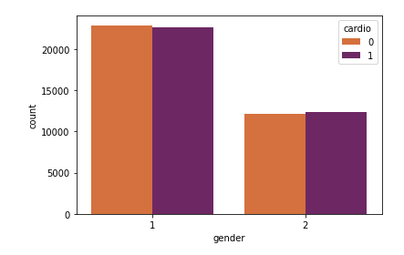
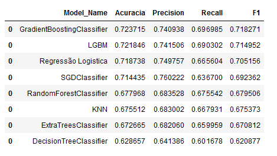

# Cardiovascular Disease

## Neste dataset/projeto denominado "Conjunto de Dados de Doenças Cardiovasculares", meu objetivo é prever (fazer um diagnóstico precoce) qual paciente desenvolverá problemas cardíacos utilizando o Aprendizado de Máquina. Também por meio da análise dos dados, é possível obter insights e fazer a hipóteses de quais fatores são a maior causa desses problemas cardíacos.

#### This project was made by Marco Albuquerque.

# 1. Business Problem.

Uma empresa especializada em detecção de doenças cardíacas tem como seu modelo de negócio o diagnóstico precoce de uma doença cardiovascular por um preço.

Meu objetivo como Data Scientist é criar um ferramenta de classificação de doentes, como uma precisão estável. E responder as perguntas abaixo:

- Qual a Acurácia e a Precisão da ferramenta?
- Quanto lucro a Cardio Catch Diseases passará a ter com a nova ferramenta?
- Qual a Confiabilidade do resultado dados pela nova ferramenta?

# 2. Business Assumptions.

Atualmente o diagnóstico é feito por uma equipe de especialistas e a precisão fica em torno de 55% a 65% devido a complexidade do diagnóstico e a fadiga da equipe. Cada diagnóstico tem um custo em torno de R$1000,00 e o preço pago pelo cliente varia em torno da precisão conseguida pelos especialistas.

O cliente paga R$500,00 a cada 5% de acurácia acima de 50%. Por exemplo, para uma precisão de 55%, o diagnóstico custa R$500,00 para o cliente, para uma precisão de 60%, o valor é de R$ 1000,00 e assim por diante. Se a precisão do diagnóstico for 50% o cliente não paga por ele. Ou seja, em alguns momentos a empresa tem prejuizos.

| Exam Accuracy | Price          | Rules                                    | Example                         |
|:--------------|:---------------|:-----------------------------------------|:--------------------------------|
| Above 50%     | min \$500\.00  | \+\$500 for each additional 5% precision | Precision = 55% \-> \$1,000\.00 |
| Up to 50%     | $0\.00         | N/A                                      | N/A                             |

# 3. Solution Strategy

My strategy to solve this challenge was:

**Step 01. Data Description:** 

Na análise descritiva eu busquei entender um pouco os dados, como o shape, o tipo dos dados, o valor mínimo e máximo de cada variável, os quartis e os dados NaN.

**Step 02. Feature Engineering:** 

A partir das variáveis que o dataset oferece, criei novas variáveis para aumentar a precisão do modelo. As variáveis criadas são:

- Soma total dos fatores de risco dos pacientes.
- Soma total dos maus hábitos dos pacientes.
- Influência da atividade física nos pacientes com fatores de risco.
- Influêcia da atividade física nos pacientes com maus hábitos.
- IMC.
- Grau de obesidade.
- Uma divisão da pressão alta pela pressão baixa.

**Step 03. Data Filtering:**

Remoção de alguns outliers (como dados de pressão alta fora do comum) e demais sujeiras que poderia prejudicar o algoritmo de Machine Learning.

**Step 04. Exploratory Data Analysis:**

Realizei análises de dados univariada, bivariada e multivariada. Também fiz testes estatísticos nas variáveis e criei hipóteses.  

**Step 05. Data Preparation:**

Alguns métodos utilizados:

- MinMaxScaller
- StandarScaller
- Frequency Encoding

**Step 06. Feature Selection:**

Utilizei dois algoritmos para selecionar as melhores variáveis (boruta e importância das árvores) e também selecionei algumas variáveis que julguei importante depois da EDA. 

**Step 07. Machine Learning Modelling:**

Modelos utilizados:

- GradientBoostingClassifier 
- LGBM
- Regressão Logistica
- SGDClassifier
- RandomForestClassifier
- ExtraTreesClassifier
- DecisionTreeClassifier

**Step 08. Hyperparameter Fine Tunning:**

**Step 09. Convert Model Performance to Business Values:**

**Step 10. Deploy Modelo to Production:**

# 4. Top 3 Data Insights

**Hypothesis 01:**

H1 - Pessoas com mais de 60 anos tem duas vezes mais chances de ter problema no coração do que uma pessoa com menos de 60 anos.

Falso - Pessoas com mais de 60 anos tem em média sete vezes mais chances de ter problemas no coração.

**Hypothesis 02:**

H2 - Pressão alta acima de 140 aumenta duas vezes o risco de ter problema no coração.

Falso - Pressão alta acima de 140 aumenta três vezes o risco de ter problemas no coração.

**Hypothesis 03:**

H3 - Em média, um gênero tem mais chances de ter problema no coração do que o outro.

Falso - Homens e mulheres tem a mesma chance de ter problemas no coração.

# 5. Machine Learning Model Applied

# 6. Machine Learning Modelo Performance

# 7. Business Results

# 8. Conclusions

# 9. Lessons Learned

# 10. Next Steps to Improve

# LICENSE

# All Rights Reserved - Comunidade DS 2021
